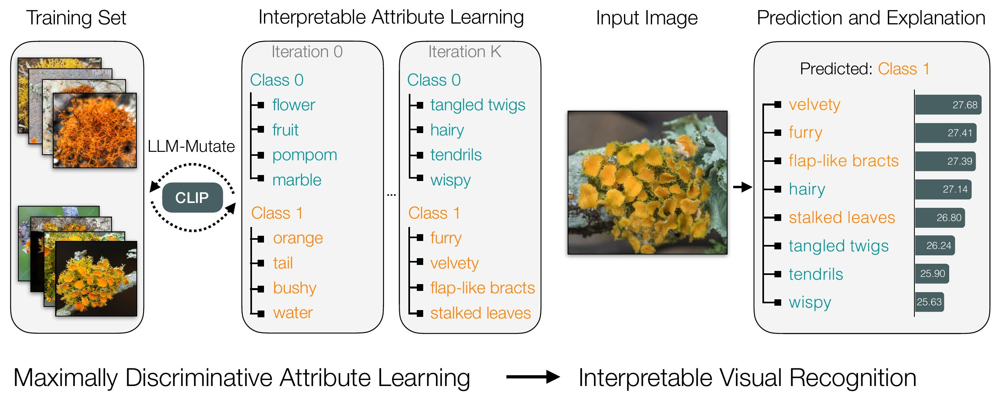

# Evolving Interpretable Visual Classifiers with Large Language Models (ECCV 2024)

This is the code for the paper [Evolving Interpretable Visual Classifiers with Large Language Models](https://llm-mutate.cs.columbia.edu/) by [Mia Chiquier](https://www.cs.columbia.edu/~mia.chiquier/), [Utkarsh Mall](https://www.cs.columbia.edu/~utkarshm/) and [Carl Vondrick](https://www.cs.columbia.edu/~vondrick/). 




## Quickstart
Clone recursively:
```bash
git clone --recurse-submodules https://github.com/mchiquier/llm-mutate.git
```

After cloning:
```bash
cd llm-mutate
export PATH=/usr/local/cuda/bin:$PATH
bash setup.sh  # This may take a while. Make sure the vipergpt environment is active
cd GLIP
python setup.py clean --all build develop --user
cd ..
echo YOUR_OPENAI_API_KEY_HERE > api.key
```

## Detailed Installation
1. Clone this repository with its submodules.
2. Install the dependencies. See the see [Dependencies](#Dependencies).
3. Download two pretrained models (the rest are downloaded automatically). See [Pretrained models](#Pretrained-models).
4. Set up the OpenAI key. See [OpenAI key](#OpenAI-key).

### Cloning this Repo

```bash
git clone --recurse-submodules https://github.com/mchiquier/llm-mutate.git
```

### Dependencies

First, create a conda environment using `setup_env.sh`. 
To do so, just `cd` into the `llm-mutate` directory, and run:

```bash
export PATH=/usr/local/cuda/bin:$PATH
bash setup_env.sh
conda activate llmmutate
```

### Pretrained models


#### vLLM

Launch a server that hosts the LLM with vLLM.
```
python -m vllm.entrypoints.openai.api_server --model meta-llama/Llama-2-70b-chat-hf --tensor-parallel-size 8 --chat-template ./examples/template_chatml.jinja --trust-remote-code
```

## Datasets

Download the iNaturalist dataset (specifically, 'train' and 'validation') from : https://github.com/visipedia/inat_comp/tree/master/2021 
Update the path to the parent folder of train and val in `config.py` : self.dataset_path = YOUR_PATH.

Download the two KikiBouba datasets here:

KikiBouba_v1: https://drive.google.com/file/d/1-a4FRS9N1DLf3_YIYq8150zN1uilapft/view?usp=sharing
KikiBouba_v2: https://drive.google.com/file/d/17ibF3tzFiZrMb9ZnpYlLEh-xmWkPJpNH/view?usp=sharing

Remember to update the `dataset_path` in the `config.py` file.

## Configuration


## Running LLM-Mutate on iNaturalist

Running this will automatically launch both pre-training and joint-training. See paper for explanation of this. 
```
python src/llm-mutate.py
```

## Inference

Specify what experiment you'd like to evaluate in the `config.py` file in the `experiment` attribute. You can pick from: `zero_shot`, `clip_scientific`, `clip_common`, `cbd_scientific`, `cbd_common`, `ours`.
```
python src/inference.py
```

## Citation

If you use this code, please consider citing the paper as:

```
@article{chiquier2024evolving,
  title={Evolving Interpretable Visual Classifiers with Large Language Models},
  author={Chiquier, Mia and Mall, Utkarsh and Vondrick, Carl},
  journal={arXiv preprint arXiv:2404.09941},
  year={2024}
}
```
